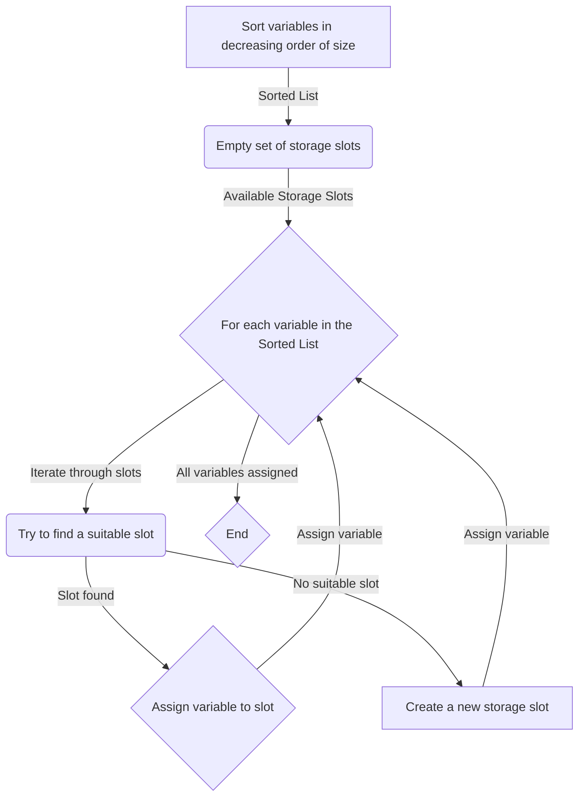

# Storage Layout Optimizer

[](https://github.com/fabelx/storage-layout-optimizer/actions/workflows/tests.yml)
___
> [!IMPORTANT]
> ## Currently, in development
___

## About
`sl_optimizer` is a Python library designed to optimize the storage layout for [Solidity](https://soliditylang.org/) smart contracts.
Efficient storage layout can reduce the number of storage slots needed, leading to lower gas costs for both storage
and computational operations. It's important to align variables to these slots
efficiently to avoid wasted space and save some money.

<details>
<summary>Problem Statement</summary>

In Solidity smart contract development, the efficient allocation of storage is a critical concern for optimizing gas costs
and overall performance. The current challenge lies in the need to carefully manage the storage layout to reduce the number
of required storage slots. The inefficient allocation of variables to these slots can result in increased gas costs for both
storage and computational operations.

Wasted space due to suboptimal storage layout not only incurs unnecessary expenses but also diminishes the overall efficiency
of smart contracts. To address this issue, developers must align variables to storage slots in an optimized manner.
However, manually achieving this level of efficiency can be time-consuming and error-prone.

To streamline this process and enhance the cost-effectiveness of Solidity smart contracts, the `sl_optimizer` Python library has been designed.
This library aims to automate and optimize the storage layout.

### Mathematical Complexity
The mathematical complexity of storage layout optimization involves determining the most efficient way to pack variables
into storage slots *(aka [Bin packing problem](https://en.wikipedia.org/wiki/Bin_packing_problem))*. This problem can be
approached with various algorithms and optimization techniques.

#### First Fit Decreasing Method
**The First Fit Decreasing (FFD)** method is a heuristic algorithm commonly used in bin packing problems, and it was
adapted for storage layout optimization in Solidity. The goal is to efficiently pack variables into 32-byte storage slots,
minimizing wasted space and optimizing gas costs.



#### Challenges:
 - Dependencies between variables might constrain the packing possibilities.
 - Arrays and mappings can complicate storage layout due to their dynamic nature.
 - Optimizing for storage efficiency must also consider the gas costs associated with reading and writing to storage.
 - Functions that use a delegate call to interact with the implementation contract.

</details>

<details>
<summary>Additional</summary>

- **Layout** *(Storage Layout)* - in code you can often find references to these names; they mean a data storage scheme that is presented in json format and can be obtained using this command `solc --storage-layout -o output Contract.sol`, an example of a smart contract storage json file [here](tests/fixtures/sample_contract_1_storage.json).
- **Storage** - refers to the `storage` field in the storage layout json file and contains information about the layout of variables (storage).
- **Type(s)** - refers to the `types` field in the storage layout json file and contains information about the types used in the smart contact.
- **[Gas](https://docs.soliditylang.org/en/latest/introduction-to-smart-contracts.html#gas)** - is the unit used to measure computational effort in the EVM.
- Solidity stores data in 32-byte chunks, also known as storage **slots**.

More information [here](https://docs.soliditylang.org/en/latest/internals/layout_in_storage.html).

</details>

___

## Installation
```bash
pip install sl_optimizer
```
From source:
```bash
make install
```
or
```bash
pip install .
```
___

## Usage
See [documentation](src/README.md) for more details.

___

### To-do
- [x] rewrite tests (improve the use of utilities in code)
- [x] add new samples ([fixtures](tests/fixtures)) for tests
- [ ] add diagnostic or metric information related to optimization
- [x] add CLI
- [x] add benchmarks (to cover optimize functionality, for local usage, not included to package)
- [x] generate 3 fixtures (large nested structures & huge number of variables & cross nested structures)
- [ ] change algorithm First Fit Decreasing -> consideration in progress ...
- [ ] restructuring storage data for optimization
___

## License
`sl_optimizer` is released under the MIT License.
See the [LICENSE](LICENSE.txt) file for license information.
